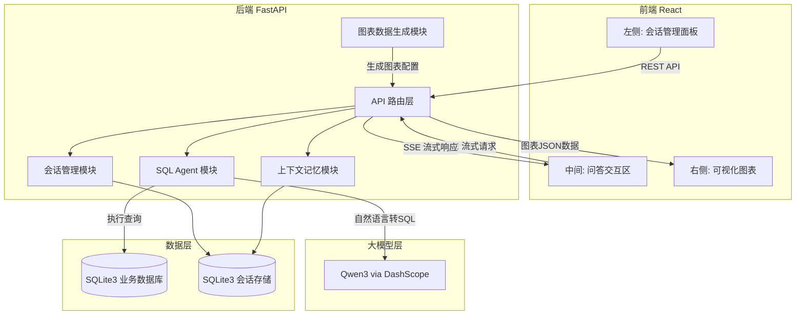
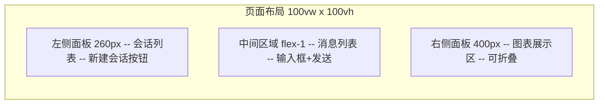
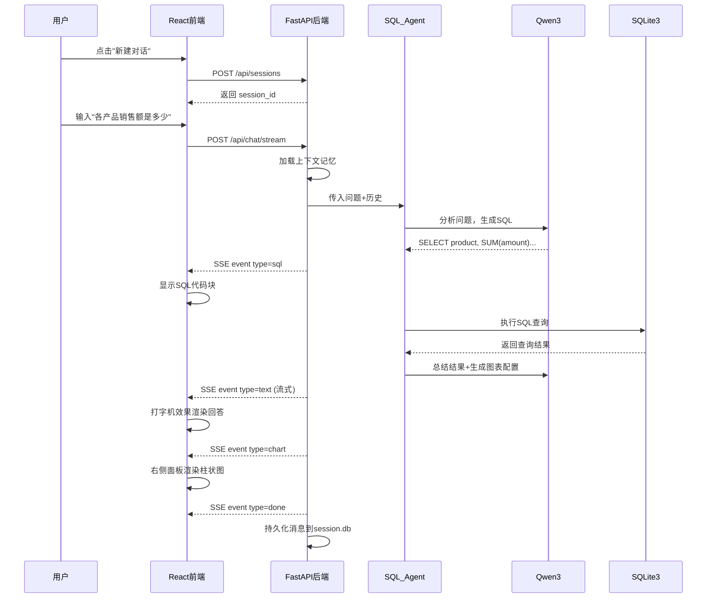

# 智能数据分析系统 - 分阶段开发计划

## 系统架构总览




## 项目目录结构

```
smart-data-analyst/
├── backend/
│   ├── app/
│   │   ├── main.py                # FastAPI 入口
│   │   ├── config.py              # 配置管理(API Key, DB路径等)
│   │   ├── models/
│   │   │   ├── schemas.py         # Pydantic 请求/响应模型
│   │   │   └── database.py        # SQLAlchemy 数据库模型
│   │   ├── routers/
│   │   │   ├── chat.py            # 聊天问答路由(含SSE流式)
│   │   │   ├── session.py         # 会话管理路由(CRUD)
│   │   │   └── data.py            # 数据管理路由(上传/查看表)
│   │   ├── services/
│   │   │   ├── llm_service.py     # Qwen3 大模型服务封装
│   │   │   ├── sql_agent.py       # LangChain SQL Agent
│   │   │   ├── session_service.py # 会话管理服务
│   │   │   ├── memory_service.py  # 上下文记忆服务
│   │   │   └── chart_service.py   # 图表数据生成服务
│   │   └── database/
│   │       ├── business.db        # 业务数据(用户查询的数据)
│   │       └── session.db         # 会话/记忆持久化存储
│   ├── requirements.txt
│   └── .env                       # 环境变量(DASHSCOPE_API_KEY)
├── frontend/
│   ├── src/
│   │   ├── App.tsx
│   │   ├── components/
│   │   │   ├── ChatSidebar/       # 左侧会话管理
│   │   │   ├── ChatArea/          # 中间问答区域
│   │   │   └── ChartPanel/        # 右侧图表面板
│   │   ├── services/
│   │   │   └── api.ts             # API 调用封装(含SSE)
│   │   ├── stores/
│   │   │   └── chatStore.ts       # 状态管理(Zustand)
│   │   └── types/
│   │       └── index.ts           # TypeScript 类型定义
│   ├── package.json
│   └── vite.config.ts
└── README.md
```

---

## Phase 1: 搭建前后端基础框架 + 运行验证

**目标**: 前后端项目能独立运行，且跨域联通。

### 1.1 后端骨架搭建

创建以下文件:

- `backend/requirements.txt` -- 所有 Python 依赖(含版本)
- `backend/.env` -- 环境变量模板(`DASHSCOPE_API_KEY=your_key_here`)
- `backend/app/config.py` -- 配置管理，读取 .env
- `backend/app/main.py` -- FastAPI 应用入口，包含:
  - CORS 中间件(允许 `http://localhost:5173`)
  - 健康检查路由: `GET /health` 返回 `{"status": "ok"}`
  - 路由注册占位(chat、session、data router 的空壳)
- 创建空的目录结构占位: `models/`、`routers/`、`services/`、`database/`

```python
# backend/app/main.py 核心骨架
from fastapi import FastAPI
from fastapi.middleware.cors import CORSMiddleware

app = FastAPI(title="Smart Data Analyst API")
app.add_middleware(CORSMiddleware, allow_origins=["http://localhost:5173"], ...)

@app.get("/health")
async def health():
    return {"status": "ok"}
```

**验收**: `uvicorn app.main:app --reload` 启动成功，访问 `http://localhost:8000/health` 返回 200。

### 1.2 前端骨架搭建

- 使用 `npm create vite@latest frontend -- --template react-ts` 初始化
- 安装核心依赖: `tailwindcss`、`zustand`、`echarts`、`echarts-for-react`、`@microsoft/fetch-event-source`、`react-markdown`、`react-syntax-highlighter`、`lucide-react`
- 配置 TailwindCSS v4
- 配置 `vite.config.ts` 中的 proxy，将 `/api` 代理到 `http://localhost:8000`
- `App.tsx` 渲染一个简单的占位页面，页面中调用 `/api/health` 验证联通

```typescript
// vite.config.ts proxy 配置
server: {
  proxy: {
    '/api': { target: 'http://localhost:8000', changeOrigin: true }
  }
}
```

**验收**: `npm run dev` 启动成功，页面正常渲染，控制台可见 `/api/health` 返回 `{"status": "ok"}`。

---

## Phase 2: 前端 UI 开发

**目标**: 完成完整的三栏 UI 布局和所有交互组件，全部使用 Mock 数据驱动。




### 2.1 三栏布局骨架 (`App.tsx`)

- 左侧固定宽度 260px
- 中间区域 flex-1 自适应
- 右侧固定宽度 400px，支持折叠/展开切换
- 深色主题风格(类 ChatGPT 风格)

### 2.2 左侧会话管理面板

- `ChatSidebar/index.tsx` -- 容器组件，组合下方子组件
- `ChatSidebar/SessionList.tsx` -- 渲染会话列表，按时间倒序排列
- `ChatSidebar/SessionItem.tsx` -- 单条会话，显示标题+时间，点击切换，右键菜单(重命名/删除)
- `ChatSidebar/NewChatButton.tsx` -- 顶部"新建对话"按钮

Mock 数据: 预置 3-5 条示例会话。

### 2.3 中间问答交互区

- `ChatArea/index.tsx` -- 容器组件
- `ChatArea/MessageList.tsx` -- 消息列表，自动滚动到底部
- `ChatArea/MessageItem.tsx` -- 单条消息，区分用户(右侧蓝色气泡)/AI(左侧灰色气泡)
- `ChatArea/SqlBlock.tsx` -- SQL 代码高亮块(react-syntax-highlighter)
- `ChatArea/ChatInput.tsx` -- 底部输入框 + 发送按钮，支持 Enter 发送 / Shift+Enter 换行

Mock 数据: 预置一段问答对话(含 SQL 块展示)。

### 2.4 右侧图表面板

- `ChartPanel/index.tsx` -- 容器组件，含折叠按钮
- `ChartPanel/ChartCard.tsx` -- 单个图表卡片，使用 echarts-for-react 渲染

Mock 数据: 预置 2 个示例图表(一个柱状图 + 一个饼图)。

### 2.5 状态管理与类型定义

- `types/index.ts`: 定义 `Session`、`Message`、`ChartConfig` 等 TypeScript 接口
- `stores/chatStore.ts`: Zustand store，管理会话列表、当前会话、消息记录、图表数据、流式状态
- `services/api.ts`: API 调用封装层(此阶段返回 Mock 数据，为 Phase 4 联调预留接口)

```typescript
// types/index.ts 核心类型
interface Session { id: string; title: string; createdAt: string; updatedAt: string }
interface Message { id: string; role: 'user' | 'assistant'; content: string; sql?: string; timestamp: string }
interface ChartConfig { id: string; type: string; title: string; option: EChartsOption }
```

**验收**: 三栏布局完整呈现，Mock 数据正常渲染，所有交互(切换会话、发送消息、折叠图表面板等)均可操作。

---

## Phase 3: 后端接口开发

**目标**: 实现所有后端功能模块和 API 接口，可通过 Swagger UI 或 curl 独立测试。

### 3.1 数据库设计与初始化

**会话数据库 (`session.db`)**:

- `sessions` 表: id(UUID), title, created_at, updated_at
- `messages` 表: id(UUID), session_id(FK), role(user/assistant), content, sql_query, chart_config(JSON), created_at

**业务数据库 (`business.db`)**:

- 预置示例数据(如: `sales` 销售表、`products` 产品表、`employees` 员工表)
- 用于演示自然语言查询功能

文件:

- `app/models/database.py` -- SQLAlchemy 模型定义 + 数据库初始化函数
- `app/models/schemas.py` -- Pydantic 请求/响应 schema

### 3.2 大模型接入 (`app/services/llm_service.py`)

- 封装 `ChatQwen` 初始化，从 config 读取 API Key
- 提供 `get_llm()` 工厂函数
- 编写简单测试脚本验证连通性

### 3.3 会话管理接口 (`app/routers/session.py` + `app/services/session_service.py`)

- `GET /api/sessions` -- 获取会话列表
- `POST /api/sessions` -- 创建新会话
- `DELETE /api/sessions/{session_id}` -- 删除会话(级联删除消息)
- `PUT /api/sessions/{session_id}` -- 重命名会话
- `GET /api/sessions/{session_id}/messages` -- 获取历史消息

### 3.4 上下文记忆 (`app/services/memory_service.py`)

- 基于 session_id 加载/保存消息历史
- 上下文窗口: 取最近 N 轮(可配置，默认 10 轮)
- 与 LangChain `ChatMessageHistory` 集成

### 3.5 SQL Agent (`app/services/sql_agent.py` + `app/services/chart_service.py`)

- 使用 `SQLDatabase` + `SQLDatabaseToolkit` + `create_react_agent` 构建
- System Prompt 中指示 LLM:
  - 先分析用户问题，生成并执行 SQL
  - 用自然语言总结查询结果
  - 若数据适合可视化，输出 `<<CHART_JSON>>{...}<<CHART_JSON>>` 格式的 ECharts 配置
- `chart_service.py`: 从 Agent 输出中解析提取图表 JSON，校验格式

### 3.6 聊天 SSE 流式接口 (`app/routers/chat.py`)

- `POST /api/chat/stream` -- 核心流式接口
- 流程: 接收消息 -> 加载上下文 -> 调用 SQL Agent -> 流式返回 -> 持久化
- SSE 事件类型: `text` / `sql` / `chart` / `error` / `done`

### 3.7 数据管理接口 (`app/routers/data.py`)

- `GET /api/data/tables` -- 获取所有表及其 schema
- `POST /api/data/upload` -- 上传 CSV 创建/追加表数据

**验收**: 所有接口可通过 `http://localhost:8000/docs` (Swagger UI) 独立测试通过。

---

## Phase 4: 前后端联调

**目标**: 将前端 Mock 数据替换为真实后端接口调用，完成端到端流程。

### 4.1 联调会话管理

- `api.ts` 中实现真实的 session CRUD 请求
- `chatStore.ts` 中 actions 调用真实 API
- 左侧 Sidebar 对接后端: 新建、切换、删除、重命名会话
- 切换会话时加载历史消息

### 4.2 联调聊天流程

- `api.ts` 中实现 `fetchEventSource` 调用 `POST /api/chat/stream`
- 处理 SSE 事件流:
  - `text` 事件 -> 追加到当前 AI 消息(打字机效果)
  - `sql` 事件 -> 在消息中插入 SQL 代码块
  - `error` 事件 -> 显示错误提示
  - `done` 事件 -> 结束流式状态
- 消息发送时自动创建会话(若当前无会话)

### 4.3 联调图表渲染

- `chart` 事件 -> 解析 ECharts option -> 追加到右侧图表面板
- 图表与对应消息关联(点击消息中的图表图标可定位右侧图表)
- 处理图表渲染异常(格式校验 + 降级提示)

### 4.4 端到端验证流程




验证清单:

- 新建会话 -> 显示在左侧列表
- 发送问题 -> 流式返回文本回答 + SQL展示
- 数据可视化 -> 右侧实时渲染图表
- 切换会话 -> 加载历史消息和图表
- 上下文记忆 -> 追问时 Agent 能理解前文
- 删除会话 -> 数据彻底清除

---

## 关键依赖清单

**后端 (`requirements.txt`):**

- `fastapi` / `uvicorn[standard]` -- Web 框架
- `sse-starlette` -- SSE 流式响应
- `langchain` / `langchain-community` / `langgraph` -- LLM 编排
- `langchain-qwq` -- Qwen3 模型接入
- `sqlalchemy` -- 数据库 ORM
- `python-dotenv` -- 环境变量管理
- `pydantic` -- 数据校验
- `aiosqlite` -- 异步 SQLite 支持
- `python-multipart` -- 文件上传支持

**前端 (`package.json`):**

- `react` / `react-dom` -- 前端框架
- `vite` -- 构建工具
- `echarts` / `echarts-for-react` -- 图表库
- `@microsoft/fetch-event-source` -- SSE 客户端
- `zustand` -- 状态管理
- `react-markdown` / `react-syntax-highlighter` -- Markdown和代码渲染
- `tailwindcss` -- 样式框架
- `lucide-react` -- 图标库

