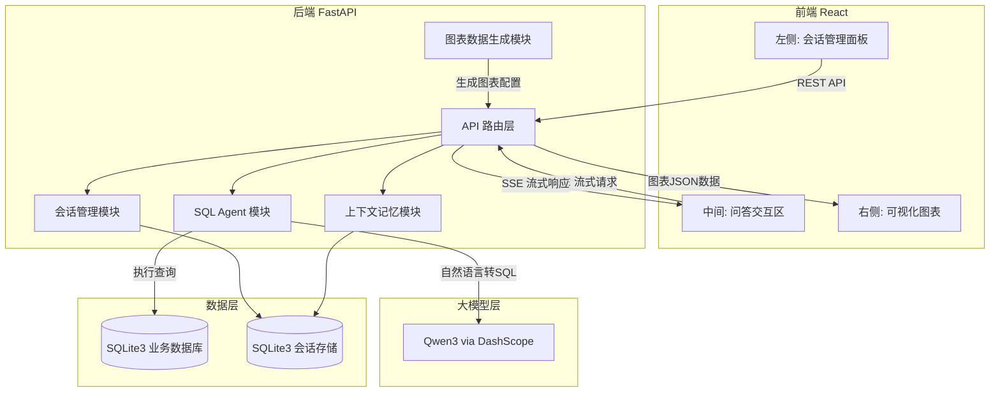
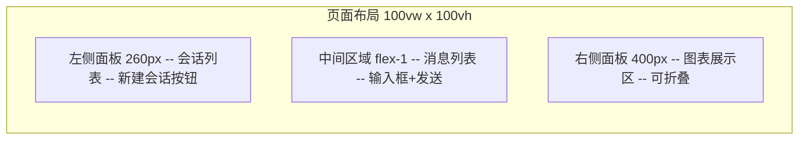
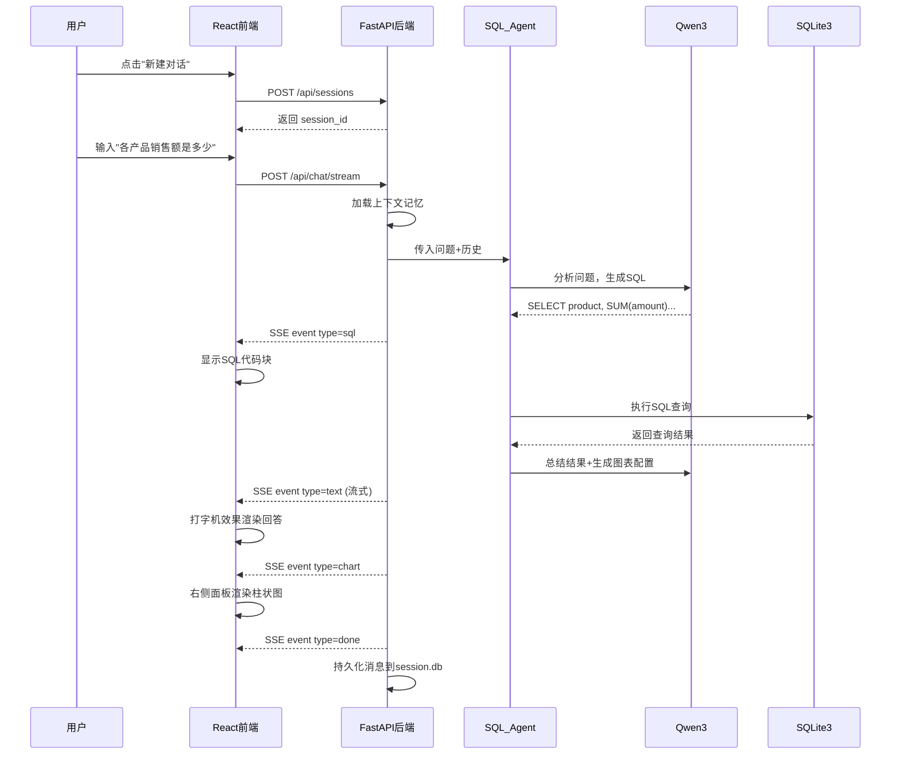

# 智能数据分析系统 - 分阶段开发计划

## 系统架构总览




## 项目目录结构

```
smart-data-analyst/
├── backend/
│   ├── app/
│   │   ├── main.py                # FastAPI 入口
│   │   ├── config.py              # 配置管理(API Key, DB路径等)
│   │   ├── models/
│   │   │   ├── schemas.py         # Pydantic 请求/响应模型
│   │   │   └── database.py        # SQLAlchemy 数据库模型
│   │   ├── routers/
│   │   │   ├── chat.py            # 聊天问答路由(含SSE流式)
│   │   │   ├── session.py         # 会话管理路由(CRUD)
│   │   │   └── data.py            # 数据管理路由(上传/查看表)
│   │   ├── services/
│   │   │   ├── llm_service.py     # 阿里云百炼模型api调用 大模型服务封装
│   │   │   ├── sql_agent.py       # LangChain SQL Agent
│   │   │   ├── session_service.py # 会话管理服务
│   │   │   ├── memory_service.py  # 上下文记忆服务
│   │   │   └── chart_service.py   # 图表数据生成服务
│   │   └── database/
│   │       ├── business.db        # 业务数据(用户查询的数据)
│   │       └── session.db         # 会话/记忆持久化存储
│   ├── requirements.txt
│   └── .env                       # 环境变量(DASHSCOPE_API_KEY)
├── frontend/
│   ├── src/
│   │   ├── App.tsx
│   │   ├── components/
│   │   │   ├── ChatSidebar/       # 左侧会话管理
│   │   │   ├── ChatArea/          # 中间问答区域
│   │   │   └── ChartPanel/        # 右侧图表面板
│   │   ├── services/
│   │   │   └── api.ts             # API 调用封装(含SSE)
│   │   ├── stores/
│   │   │   └── chatStore.ts       # 状态管理(Zustand)
│   │   └── types/
│   │       └── index.ts           # TypeScript 类型定义
│   ├── package.json
│   └── vite.config.ts
└── README.md
```

---

## Phase 1: 搭建前后端基础框架 + 运行验证

**目标**: 前后端项目能独立运行，且跨域联通。

### 1.1 后端骨架搭建

创建以下文件:

- `backend/requirements.txt` -- 所有 Python 依赖(含版本)
- `backend/.env` -- 环境变量模板(`DASHSCOPE_API_KEY=your_key_here`)
- `backend/app/config.py` -- 配置管理，读取 .env
- `backend/app/main.py` -- FastAPI 应用入口，包含:
  - CORS 中间件(允许 `http://localhost:5173`)
  - 健康检查路由: `GET /health` 返回 `{"status": "ok"}`
  - 路由注册占位(chat、session、data router 的空壳)
- 创建空的目录结构占位: `models/`、`routers/`、`services/`、`database/`

```python
# backend/app/main.py 核心骨架
from fastapi import FastAPI
from fastapi.middleware.cors import CORSMiddleware

app = FastAPI(title="Smart Data Analyst API")
app.add_middleware(CORSMiddleware, allow_origins=["http://localhost:5173"], ...)

@app.get("/health")
async def health():
    return {"status": "ok"}
```

**验收**: `uvicorn app.main:app --reload` 启动成功，访问 `http://localhost:8000/health` 返回 200。

### 1.2 前端骨架搭建

- 使用 `npm create vite@latest frontend -- --template react-ts` 初始化
- 安装核心依赖: `tailwindcss`、`zustand`、`echarts`、`echarts-for-react`、`@microsoft/fetch-event-source`、`react-markdown`、`react-syntax-highlighter`、`lucide-react`
- 配置 TailwindCSS v4
- 配置 `vite.config.ts` 中的 proxy，将 `/api` 代理到 `http://localhost:8000`
- `App.tsx` 渲染一个简单的占位页面，页面中调用 `/api/health` 验证联通

```typescript
// vite.config.ts proxy 配置
server: {
  proxy: {
    '/api': { target: 'http://localhost:8000', changeOrigin: true }
  }
}
```

**验收**: `npm run dev` 启动成功，页面正常渲染，控制台可见 `/api/health` 返回 `{"status": "ok"}`。

---

## Phase 2: 前端 UI 开发

**目标**: 完成完整的三栏 UI 布局和所有交互组件，全部使用 Mock 数据驱动。




### 2.1 三栏布局骨架 (`App.tsx`)

- 左侧固定宽度 260px
- 中间区域 flex-1 自适应
- 右侧固定宽度 400px，支持折叠/展开切换
- 深色主题风格(类 ChatGPT 风格)

### 2.2 左侧会话管理面板

- `ChatSidebar/index.tsx` -- 容器组件，组合下方子组件
- `ChatSidebar/SessionList.tsx` -- 渲染会话列表，按时间倒序排列
- `ChatSidebar/SessionItem.tsx` -- 单条会话，显示标题+时间，点击切换，右键菜单(重命名/删除)
- `ChatSidebar/NewChatButton.tsx` -- 顶部"新建对话"按钮

Mock 数据: 预置 3-5 条示例会话。

### 2.3 中间问答交互区

- `ChatArea/index.tsx` -- 容器组件
- `ChatArea/MessageList.tsx` -- 消息列表，自动滚动到底部
- `ChatArea/MessageItem.tsx` -- 单条消息，区分用户(右侧蓝色气泡)/AI(左侧灰色气泡)
- `ChatArea/SqlBlock.tsx` -- SQL 代码高亮块(react-syntax-highlighter)
- `ChatArea/ChatInput.tsx` -- 底部输入框 + 发送按钮，支持 Enter 发送 / Shift+Enter 换行

Mock 数据: 预置一段问答对话(含 SQL 块展示)。

### 2.4 右侧图表面板

- `ChartPanel/index.tsx` -- 容器组件，含折叠按钮
- `ChartPanel/ChartCard.tsx` -- 单个图表卡片，使用 echarts-for-react 渲染

Mock 数据: 预置 2 个示例图表(一个柱状图 + 一个饼图)。

### 2.5 状态管理与类型定义

- `types/index.ts`: 定义 `Session`、`Message`、`ChartConfig` 等 TypeScript 接口
- `stores/chatStore.ts`: Zustand store，管理会话列表、当前会话、消息记录、图表数据、流式状态
- `services/api.ts`: API 调用封装层(此阶段返回 Mock 数据，为 Phase 4 联调预留接口)

```typescript
// types/index.ts 核心类型
interface Session { id: string; title: string; createdAt: string; updatedAt: string }
interface Message { id: string; role: 'user' | 'assistant'; content: string; sql?: string; timestamp: string }
interface ChartConfig { id: string; type: string; title: string; option: EChartsOption }
```

**验收**: 三栏布局完整呈现，Mock 数据正常渲染，所有交互(切换会话、发送消息、折叠图表面板等)均可操作。

---

## Phase 3: 后端接口开发

**目标**: 实现所有后端功能模块和 API 接口，可通过 Swagger UI 或 curl 独立测试。

> **⚠ 开发规范 — LLM 实测字段参考 (deepseek-v3.2 via DashScope + langchain-qwq)**
>
> 以下字段结构来源于 `test_llm.py` 实测结果，在 Phase 3 开发中**必须严格按照这些字段进行读写**，以保证数据流从 LLM → 后端服务 → SSE 前端的正确传递。

### LLM 返回字段规范

#### A. 基础调用 (`llm.invoke()`) — 返回 `AIMessage`


| 字段路径                                                       | 类型    | 说明                                       | 示例值                           |
| ---------------------------------------------------------- | ----- | ---------------------------------------- | ----------------------------- |
| `response.content`                                         | `str` | 模型回复的文本内容                                | `"我是一个AI助手..."`               |
| `response.id`                                              | `str` | LangChain 运行 ID                          | `"lc_run--019c523e-18f7-..."` |
| `response.response_metadata.token_usage.completion_tokens` | `int` | 输出 token 数                               | `12`                          |
| `response.response_metadata.token_usage.prompt_tokens`     | `int` | 输入 token 数                               | `17`                          |
| `response.response_metadata.token_usage.total_tokens`      | `int` | 总 token 数                                | `29`                          |
| `response.response_metadata.model_name`                    | `str` | 实际使用的模型名                                 | `"deepseek-v3.2"`             |
| `response.response_metadata.model_provider`                | `str` | 模型提供方                                    | `"dashscope"`                 |
| `response.response_metadata.finish_reason`                 | `str` | 结束原因：`"stop"` 正常结束，`"tool_calls"` 触发工具调用 | `"stop"`                      |
| `response.usage_metadata.input_tokens`                     | `int` | 输入 token (同 prompt_tokens)               | `17`                          |
| `response.usage_metadata.output_tokens`                    | `int` | 输出 token (同 completion_tokens)           | `12`                          |
| `response.usage_metadata.input_token_details.cache_read`   | `int` | 缓存命中的 token 数                            | `0`                           |


#### B. 流式输出 (`llm.stream()`) — 逐步产出 `AIMessageChunk`


| 字段路径                      | 类型     | 说明                     | 注意事项                                     |
| ------------------------- | ------ | ---------------------- | ---------------------------------------- |
| `chunk.content`           | `str`  | 本次 chunk 的文本增量         | **第 1 个 chunk 的 content 为空字符串 `""**`，需跳过 |
| `chunk.id`                | `str`  | 同一次流式的所有 chunk 共享相同 ID | `"lc_run--019c523e-2abb-..."`            |
| `chunk.response_metadata` | `dict` | 仅含 `model_provider`    | `{'model_provider': 'dashscope'}`        |
| `chunk.usage_metadata`    | `dict  | None`                  | 仅最后一个 chunk 可能携带用量信息                     |


**流式处理代码模式:**

```python
async for chunk in llm.astream(messages):
    if chunk.content:  # 跳过空内容 chunk
        yield {"type": "text", "content": chunk.content}
```

#### C. 工具调用 (Tool Calling) — `bind_tools()` 后调用

**非流式返回 (`llm_with_tools.invoke()`) — `AIMessage`:**


| 字段路径                                       | 类型           | 说明                        | 示例值                               |
| ------------------------------------------ | ------------ | ------------------------- | --------------------------------- |
| `response.content`                         | `str`        | 可能包含思考过程文本                | `"好的，让我查询笔记本电脑的销售数据。\n\n"`        |
| `response.tool_calls`                      | `list[dict]` | 工具调用列表                    | 见下方结构                             |
| `response.tool_calls[i].name`              | `str`        | 工具函数名                     | `"query_sales"`                   |
| `response.tool_calls[i].args`              | `dict`       | 参数字典（已解析为 Python dict）    | `{"product_name": "笔记本电脑"}`       |
| `response.tool_calls[i].id`                | `str`        | 调用 ID，用于匹配 ToolMessage    | `"call_b919ba335a7b4384876a30de"` |
| `response.tool_calls[i].type`              | `str`        | 固定值                       | `"tool_call"`                     |
| `response.response_metadata.finish_reason` | `str`        | 触发工具时为 `"tool_calls"`     | `"tool_calls"`                    |
| `response.additional_kwargs.refusal`       | `None`       | 拒绝字段（DashScope 固定返回 null） | `null`                            |


**工具调用判断逻辑:**

```python
response = llm_with_tools.invoke(messages)
if response.tool_calls:
    for tool_call in response.tool_calls:
        tool_name = tool_call["name"]      # str: 工具名称
        tool_args = tool_call["args"]      # dict: 参数
        tool_call_id = tool_call["id"]     # str: 调用ID
        # 执行对应工具，构造 ToolMessage 返回
elif response.content:
    # 无需调用工具，直接返回文本
    pass
```

**流式 + 工具调用 (`llm_with_tools.stream()`) — 逐步产出 `AIMessageChunk`:**


| 字段路径                              | 类型           | 说明                 | 注意事项                                     |
| --------------------------------- | ------------ | ------------------ | ---------------------------------------- |
| `chunk.content`                   | `str`        | 文本增量（工具调用前可能有思考文本） | 前几个 chunk 含文本                            |
| `chunk.tool_calls`                | `list[dict]` | **部分解析**的工具调用      | 仅首个 tool chunk 含完整 `name` 和 `id`         |
| `chunk.tool_call_chunks`          | `list[dict]` | 工具调用的增量片段          | 需手动合并                                    |
| `chunk.tool_call_chunks[i].name`  | `str         | None`              | 仅首个 chunk 有工具名                           |
| `chunk.tool_call_chunks[i].args`  | `str`        | JSON 字符串的增量片段      | 依次为 `""`, `"{"`, `'"key": "val"'`, `"}"` |
| `chunk.tool_call_chunks[i].id`    | `str`        | 仅首个 chunk 有完整 ID   | 后续为 `""`                                 |
| `chunk.tool_call_chunks[i].index` | `int`        | 工具调用索引             | 通常为 `0`                                  |


**流式工具调用合并模式:**

```python
from langchain_core.messages import AIMessageChunk

chunks = []
async for chunk in llm_with_tools.astream(messages):
    chunks.append(chunk)
    if chunk.content:
        yield {"type": "text", "content": chunk.content}

# 合并所有 chunks 获取最终完整的 tool_calls
if chunks:
    final = chunks[0]
    for c in chunks[1:]:
        final = final + c  # AIMessageChunk 支持 + 合并
    if final.tool_calls:
        for tc in final.tool_calls:
            # tc["name"], tc["args"], tc["id"] 此时完整可用
            pass
```

#### D. LLM 初始化配置参考

```python
from langchain_qwq import ChatQwen

llm = ChatQwen(
    model="deepseek-v3.2",              # 模型名称
    max_tokens=2048,                     # 最大输出 token
    streaming=True,                      # 启用流式（调 .stream()/.astream() 时必须）
    # API Key 和 Base URL 从环境变量自动读取:
    #   DASHSCOPE_API_KEY
    #   DASHSCOPE_API_BASE = https://dashscope.aliyuncs.com/compatible-mode/v1
)
```

### NL2SQL 组件实测字段规范

> 以下字段结构来源于 `test_nl2sql.py` 实测结果（基于 deepseek-v3.2 + langchain-community），在 Phase 3 开发中**必须严格按照这些接口进行组件对接**。

#### E. `SQLDatabase` — 数据库连接包装器

**包**: `langchain_community.utilities.SQLDatabase`

```python
from langchain_community.utilities import SQLDatabase
db = SQLDatabase.from_uri("sqlite:///business.db")
```


| API                                    | 输入                             | 输出类型          | 输出说明                                                        |
| -------------------------------------- | ------------------------------ | ------------- | ----------------------------------------------------------- |
| `SQLDatabase.from_uri(uri)`            | `str` (如 `"sqlite:///xxx.db"`) | `SQLDatabase` | 数据库连接实例                                                     |
| `db.dialect`                           | 无                              | `str`         | 数据库方言，如 `"sqlite"`                                          |
| `db.get_usable_table_names()`          | 无                              | `list[str]`   | 可用表名列表，如 `['employees', 'products', 'sales']`               |
| `db.get_table_info()`                  | 无                              | `str`         | 全部表的 `CREATE TABLE` DDL + 前 3 行示例数据                         |
| `db.get_table_info(table_names=["x"])` | `list[str]`                    | `str`         | 指定表的 DDL + 示例数据                                             |
| `db.run(sql)`                          | `str` (SQL 语句)                 | `str`         | 元组列表的字符串，如 `"[('笔记本电脑', 5999.0)]"`                          |
| `db.run(sql, include_columns=True)`    | `str`                          | `str`         | **字典列表**字符串（含列名），如 `"[{'name': '笔记本电脑', 'price': 5999.0}]"` |


`**get_table_info()` 输出格式示例:**

```
CREATE TABLE products (
	id INTEGER,
	name TEXT NOT NULL,
	category TEXT NOT NULL,
	price REAL NOT NULL,
	stock INTEGER NOT NULL,
	PRIMARY KEY (id)
)

/*
3 rows from products table:
id	name	category	price	stock
1	笔记本电脑	电子产品	5999.0	150
2	智能手机	电子产品	3999.0	300
3	无线耳机	配件	299.0	500
*/
```

#### F. `SQLDatabaseToolkit` — SQL 工具集（4 个内置工具）

**包**: `langchain_community.agent_toolkits.SQLDatabaseToolkit`

```python
from langchain_community.agent_toolkits import SQLDatabaseToolkit
toolkit = SQLDatabaseToolkit(db=db, llm=llm)
tools = toolkit.get_tools()  # 返回 4 个工具
```


| #   | 工具名                    | 类名                     | 输入参数 (args_schema)              | 输出                                        | 说明        |
| --- | ---------------------- | ---------------------- | ------------------------------- | ----------------------------------------- | --------- |
| 0   | `sql_db_query`         | `QuerySQLDatabaseTool` | `{"query": str}` — 完整 SQL 语句    | `str` — 元组列表字符串                           | 执行 SQL 查询 |
| 1   | `sql_db_schema`        | `InfoSQLDatabaseTool`  | `{"table_names": str}` — 逗号分隔表名 | `str` — DDL + 示例行                         | 获取表结构     |
| 2   | `sql_db_list_tables`   | `ListSQLDatabaseTool`  | `{"tool_input": ""}` — 空字符串     | `str` — 逗号分隔表名                            | 列出所有表     |
| 3   | `sql_db_query_checker` | `QuerySQLCheckerTool`  | `{"query": str}` — 待检查 SQL      | `str` — LLM 修正后的 SQL（可能包裹在 markdown 代码块中） | 语法检查      |


**手动调用示例:**

```python
# 列出表
list_tool = next(t for t in tools if t.name == "sql_db_list_tables")
list_tool.invoke("")  # 返回: "employees, products, sales"

# 查询表结构
schema_tool = next(t for t in tools if t.name == "sql_db_schema")
schema_tool.invoke("products, sales")  # 返回: CREATE TABLE ... + 示例行

# 执行 SQL
query_tool = next(t for t in tools if t.name == "sql_db_query")
query_tool.invoke("SELECT name, price FROM products ORDER BY price DESC LIMIT 3")
# 返回: "[('笔记本电脑', 5999.0), ('智能手机', 3999.0), ('显示器', 2499.0)]"

# 检查 SQL（会自动纠错）
checker_tool = next(t for t in tools if t.name == "sql_db_query_checker")
checker_tool.invoke("SELCT * FORM products")
# 返回: "```sql\nSELECT * FROM products\n```"
```

#### G. `create_agent` — SQL Agent 创建与调用

**包**: `langchain.agents.create_agent`（底层基于 LangGraph）

```python
from langchain.agents import create_agent
agent = create_agent(llm, tools, system_prompt=system_prompt)
# agent 类型: langgraph.graph.state.CompiledStateGraph
```

**非流式调用 (`agent.invoke()`):**

```python
result = agent.invoke({"messages": [{"role": "user", "content": "各产品销售额是多少？"}]})
# 返回: dict，keys: ["messages"]
# result["messages"]: 完整消息链（含所有中间步骤）
```

**消息链结构（实测 30 条消息的典型模式）:**

```
[HumanMessage]  — 用户问题
[AIMessage]     — LLM 调用 sql_db_list_tables (finish_reason="tool_calls")
[ToolMessage]   — 返回: "employees, products, sales" (name="sql_db_list_tables")
[AIMessage]     — LLM 调用 sql_db_schema
[ToolMessage]   — 返回: 表结构 DDL
[AIMessage]     — LLM 生成 SQL，调用 sql_db_query_checker
[ToolMessage]   — 返回: 修正后的 SQL
[AIMessage]     — LLM 调用 sql_db_query 执行查询
[ToolMessage]   — 返回: 查询结果
...（可能多轮工具调用）
[AIMessage]     — 最终自然语言总结 (finish_reason="stop")
```

**消息链中各消息类型的关键字段:**

```python
# AIMessage（LLM 调用工具时）
msg.content                              # str: 思考过程文本（可能为 ''）
msg.tool_calls                           # list[dict]: [{"name": "sql_db_query", "args": {"query": "SELECT..."}, "id": "call_xxx", "type": "tool_call"}]
msg.response_metadata["finish_reason"]   # "tool_calls"

# ToolMessage（工具返回）
msg.content        # str: 工具执行结果（如查询结果字符串）
msg.name           # str: 工具名称（如 "sql_db_query", "sql_db_schema"）
msg.tool_call_id   # str: 对应 AIMessage 中 tool_calls[i]["id"]

# AIMessage（最终回答）
msg.content                              # str: 完整的自然语言总结
msg.response_metadata["finish_reason"]   # "stop"
msg.tool_calls                           # [] （空列表）
```

#### H. Agent 流式输出 — 两种模式

**模式 A: `agent.astream()` — 按步骤流式**

```python
async for step in agent.astream({"messages": [...]}):
    # step: dict, keys 为 "model" 或 "tools"
    # step["model"]["messages"] → [AIMessage]   (LLM 思考/调用工具)
    # step["tools"]["messages"] → [ToolMessage] (工具执行结果)
```

- 每步一个 dict，总步数 = LLM 调用次数 + 工具执行次数（实测约 9 步）
- **适用场景**: 监控 Agent 进度，粗粒度流式

**模式 B: `agent.astream_events(version="v2")` — 细粒度事件流（推荐用于 SSE）**

```python
async for event in agent.astream_events({"messages": [...]}, version="v2"):
    event["event"]  # str: 事件类型
    event["name"]   # str: 组件名称
    event["data"]   # dict: 事件数据
```

**关键事件类型与用途:**


| 事件 (`event`)           | 名称 (`name`)      | `data` 内容                                                                            | 用途                                                    |
| ---------------------- | ---------------- | ------------------------------------------------------------------------------------ | ----------------------------------------------------- |
| `on_chat_model_stream` | `ChatQwen`       | `data["chunk"]` → `AIMessageChunk`（含 `.content`, `.tool_calls`, `.tool_call_chunks`） | **推送 `text` SSE 事件** — 抓取 `chunk.content`             |
| `on_chat_model_end`    | `ChatQwen`       | `data["output"]` → 完整 `AIMessage`                                                    | 获取本轮 LLM 完整输出                                         |
| `on_tool_start`        | `sql_db_query` 等 | `data["input"]` → 工具参数字典（如 `{"query": "SELECT..."}`                                  | **推送 `sql` SSE 事件** — 从 `sql_db_query` 的 input 抓取 SQL |
| `on_tool_end`          | `sql_db_query` 等 | `data["output"]` → `ToolMessage`                                                     | 获取工具执行结果                                              |
| `on_chain_start`       | `LangGraph`      | `data["input"]` → 初始消息                                                               | Agent 启动                                              |
| `on_chain_start`       | `tools`          | `data["input"]` → 含 `tool_call` 详情                                                   | 工具节点启动                                                |


**SSE 推送实现核心逻辑（基于 astream_events）:**

```python
collected_sql = None

async for event in agent.astream_events({"messages": messages}, version="v2"):
    evt = event["event"]
    name = event["name"]
    data = event.get("data", {})

    # 1. 流式文本 → 推送 text 事件
    if evt == "on_chat_model_stream" and name == "ChatQwen":
        chunk = data.get("chunk")
        if chunk and chunk.content:
            yield sse_event("text", chunk.content)

    # 2. 工具开始执行 → 抓取 SQL 语句
    elif evt == "on_tool_start" and name == "sql_db_query":
        sql = data.get("input", {}).get("query", "")
        if sql:
            collected_sql = sql
            yield sse_event("sql", sql)

    # 3. 工具执行完成 → 可选：推送查询结果
    elif evt == "on_tool_end" and name == "sql_db_query":
        pass  # 查询结果会被 LLM 总结后以 text 形式输出

# 4. 循环结束 → 推送 done 事件
yield sse_event("done", "")
```

#### I. Agent 多轮对话 — 消息历史传递方式

```python
# 第 1 轮
result1 = agent.invoke({"messages": [{"role": "user", "content": "笔记本电脑总销售额？"}]})
history = result1["messages"]  # 完整消息链（实测 14 条）

# 第 2 轮 — 将全部历史 + 新问题传入
result2 = agent.invoke({"messages": history + [{"role": "user", "content": "智能手机呢？"}]})
# result2["messages"] 包含两轮完整历史（实测 24 条）
```

**注意事项:**

- `messages` 列表中包含所有类型: `HumanMessage`, `AIMessage`, `ToolMessage`
- 多轮时 Agent 能理解上下文（如"那智能手机呢？跟笔记本比哪个高？"）
- **上下文裁剪**: 随着轮次增多消息链膨胀很快（每轮约 10-15 条），需结合 `memory_service` 裁剪到最近 N 轮

---

### 3.1 数据库设计与初始化

**会话数据库 (`session.db`)**:

- `sessions` 表: id(UUID), title, created_at, updated_at
- `messages` 表: id(UUID), session_id(FK), role(user/assistant), content, sql_query, chart_config(JSON), created_at

**业务数据库 (`business.db`)**:

- 预置示例数据(如: `sales` 销售表、`products` 产品表、`employees` 员工表)
- 用于演示自然语言查询功能

文件:

- `app/models/database.py` -- SQLAlchemy 模型定义 + 数据库初始化函数
- `app/models/schemas.py` -- Pydantic 请求/响应 schema

### 3.2 大模型接入 (`app/services/llm_service.py`)

- 封装 `ChatQwen` 初始化，从 config 读取 API Key
- 使用 `ChatQwen(model="deepseek-v3.2", streaming=True)` 实例化
- 提供 `get_llm()` 工厂函数，返回配置好的 LLM 实例
- 提供 `get_llm_with_tools(tools)` 函数，返回 `llm.bind_tools(tools)` 实例
- 判断工具调用: 检查 `response.tool_calls` 是否非空
- 判断结束原因: 读取 `response.response_metadata["finish_reason"]`（`"stop"` / `"tool_calls"`）
- 编写简单测试脚本验证连通性

### 3.3 会话管理接口 (`app/routers/session.py` + `app/services/session_service.py`)

- `GET /api/sessions` -- 获取会话列表
- `POST /api/sessions` -- 创建新会话
- `DELETE /api/sessions/{session_id}` -- 删除会话(级联删除消息)
- `PUT /api/sessions/{session_id}` -- 重命名会话
- `GET /api/sessions/{session_id}/messages` -- 获取历史消息

### 3.4 上下文记忆 (`app/services/memory_service.py`)

- 基于 session_id 加载/保存消息历史
- 上下文窗口: 取最近 N 轮(可配置，默认 10 轮)
- 与 LangChain `ChatMessageHistory` 集成

### 3.5 SQL Agent (`app/services/sql_agent.py` + `app/services/chart_service.py`)

- 使用 `SQLDatabase` + `SQLDatabaseToolkit` + `create_agent` 构建（参见规范 E/F/G）
- Agent 类型为 `CompiledStateGraph`（LangGraph），调用方式: `agent.invoke()` / `agent.astream()` / `agent.astream_events()`
- SQL Agent 构建代码:

```python
from langchain_community.utilities import SQLDatabase
from langchain_community.agent_toolkits import SQLDatabaseToolkit
from langchain.agents import create_agent

db = SQLDatabase.from_uri(f"sqlite:///{db_path}")
toolkit = SQLDatabaseToolkit(db=db, llm=get_llm())
tools = toolkit.get_tools()  # 4 个工具: sql_db_query, sql_db_schema, sql_db_list_tables, sql_db_query_checker
agent = create_agent(get_llm(), tools, system_prompt=system_prompt)
```

- System Prompt 中指示 LLM:
  - 先查看表列表 (`sql_db_list_tables`)，再查看相关表结构 (`sql_db_schema`)
  - 生成 SQL 前用 `sql_db_query_checker` 检查语法
  - 用自然语言总结查询结果
  - 若数据适合可视化，输出 `<<CHART_JSON>>{...}<<CHART_JSON>>` 格式的 ECharts 配置
  - 禁止 DML 操作（INSERT/UPDATE/DELETE/DROP）
- `chart_service.py`: 从 Agent 最终回答（`AIMessage.content`，`finish_reason="stop"`）中用正则提取 `<<CHART_JSON>>` 包裹的图表 JSON，校验格式
- **流式 Agent 输出**: 使用 `agent.astream_events(version="v2")`（参见规范 H），通过事件过滤实现:
  - `on_chat_model_stream` (name=ChatQwen) → 推送 `text` SSE 事件
  - `on_tool_start` (name=sql_db_query) → 从 `data["input"]["query"]` 推送 `sql` SSE 事件
- **多轮对话**: 将上一轮 `result["messages"]` 完整传入下一轮调用（参见规范 I），结合 `memory_service` 裁剪历史

### 3.6 聊天 SSE 流式接口 (`app/routers/chat.py`)

- `POST /api/chat/stream` -- 核心流式接口
- 流程: 接收消息 -> 加载上下文 -> 调用 SQL Agent -> 流式返回 -> 持久化
- SSE 事件类型: `text` / `sql` / `chart` / `error` / `done`
- **SSE 数据格式规范**（每个事件为 JSON 字符串）:

```python
# text 事件 — 逐步推送 AI 回复文本
{"type": "text", "content": "根据查询结果..."}

# sql 事件 — 推送生成的 SQL 语句
{"type": "sql", "content": "SELECT product, SUM(amount) FROM sales GROUP BY product"}

# chart 事件 — 推送完整的 ECharts 图表配置
{"type": "chart", "config": {"id": "chart-xxx", "type": "bar", "title": "销售额", "option": {...}}}

# error 事件 — 推送错误信息
{"type": "error", "content": "查询失败: table not found"}

# done 事件 — 标记流式结束
{"type": "done", "content": ""}
```

- **流式推送实现要点**（基于 `agent.astream_events(version="v2")`，参见规范 H）:
  - 监听 `on_chat_model_stream` (name=ChatQwen)，若 `chunk.content` 非空则推送 `text` 事件
  - 监听 `on_tool_start` (name=sql_db_query)，从 `data["input"]["query"]` 推送 `sql` 事件
  - 监听 Agent 最终回答（`finish_reason="stop"` 的 `AIMessage`），检查是否包含 `<<CHART_JSON>>` 并推送 `chart` 事件
  - 跳过第 1 个 content 为空字符串的 chunk（DashScope 特性）
  - 使用 `sse-starlette` 的 `EventSourceResponse` 封装异步生成器
  - 异常捕获: 推送 `error` 事件后推送 `done` 事件

### 3.7 数据管理接口 (`app/routers/data.py`)

- `GET /api/data/tables` -- 获取所有表及其 schema
- `POST /api/data/upload` -- 上传 CSV 创建/追加表数据

**验收**: 所有接口可通过 `http://localhost:8000/docs` (Swagger UI) 独立测试通过。

---

## Phase 4: 前后端联调

**目标**: 将前端 Mock 数据替换为真实后端接口调用，完成端到端流程。

### 4.1 联调会话管理

- `api.ts` 中实现真实的 session CRUD 请求
- `chatStore.ts` 中 actions 调用真实 API
- 左侧 Sidebar 对接后端: 新建、切换、删除、重命名会话
- 切换会话时加载历史消息

### 4.2 联调聊天流程

- `api.ts` 中实现 `fetchEventSource` 调用 `POST /api/chat/stream`
- 处理 SSE 事件流:
  - `text` 事件 -> 追加到当前 AI 消息(打字机效果)
  - `sql` 事件 -> 在消息中插入 SQL 代码块
  - `error` 事件 -> 显示错误提示
  - `done` 事件 -> 结束流式状态
- 消息发送时自动创建会话(若当前无会话)

### 4.3 联调图表渲染

- `chart` 事件 -> 解析 ECharts option -> 追加到右侧图表面板
- 图表与对应消息关联(点击消息中的图表图标可定位右侧图表)
- 处理图表渲染异常(格式校验 + 降级提示)

### 4.4 端到端验证流程




验证清单:

- 新建会话 -> 显示在左侧列表
- 发送问题 -> 流式返回文本回答 + SQL展示
- 数据可视化 -> 右侧实时渲染图表
- 切换会话 -> 加载历史消息和图表
- 上下文记忆 -> 追问时 Agent 能理解前文
- 删除会话 -> 数据彻底清除

---

## 关键依赖清单

**后端 (`requirements.txt`):**

- `fastapi` / `uvicorn[standard]` -- Web 框架
- `sse-starlette` -- SSE 流式响应
- `langchain` / `langchain-community` / `langgraph` -- LLM 编排
- `langchain-qwq` -- Qwen3 模型接入
- `sqlalchemy` -- 数据库 ORM
- `python-dotenv` -- 环境变量管理
- `pydantic` -- 数据校验
- `aiosqlite` -- 异步 SQLite 支持
- `python-multipart` -- 文件上传支持

**前端 (`package.json`):**

- `react` / `react-dom` -- 前端框架
- `vite` -- 构建工具
- `echarts` / `echarts-for-react` -- 图表库
- `@microsoft/fetch-event-source` -- SSE 客户端
- `zustand` -- 状态管理
- `react-markdown` / `react-syntax-highlighter` -- Markdown和代码渲染
- `tailwindcss` -- 样式框架
- `lucide-react` -- 图标库

